# Exemple de soumission d'activité
ÉTS - LOG430 - Architecture logicielle - Été 2026

Étudiant(e) : Chris-Emmanuel Berton

# Questions
(Il est obligatoire d'ajouter du code, des captures d'écran ou des sorties de terminal pour illustrer chacune de vos réponses.)

## 1. Question 1 : Quelle réponse obtenons-nous à la requête à POST /payments ? Illustrez votre réponse avec des captures d'écran/du terminal.
Réponse
Erreur interne lorsque utilise krakend et problème de permissions lorsque passe par API directement.

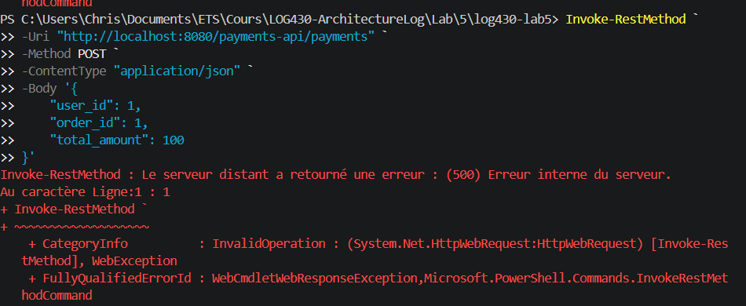

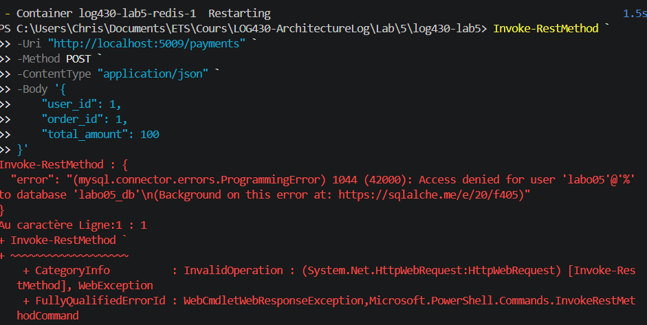

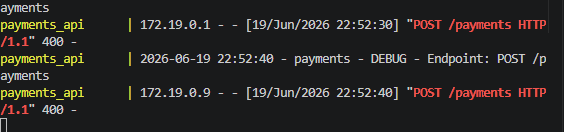

## 2. Question 2 : Quel type d'information envoyons-nous dans la requête à POST payments/process/:id ? Est-ce que ce serait le même format si on communiquait avec un service SOA, par exemple ? Illustrez votre réponse avec des exemples et captures d'écran/terminal.

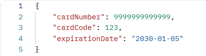
La requête Post payments/process/:id envoie les informations de la carte de crédit utilisée pour le paiement
Dans le cas d'un service d'une architecture orientée service, le format serait différent puisqu'on utiliserait des interfaces standards tels SOAP et REST, alors que dans cette infrastructure, on utilise le format défini dans le le JSON.
## 3. Question 3 : Quel résultat obtenons-nous de la requête à POST payments/process/:id?

Les requêtes concernant les orders sont sans problèmes.
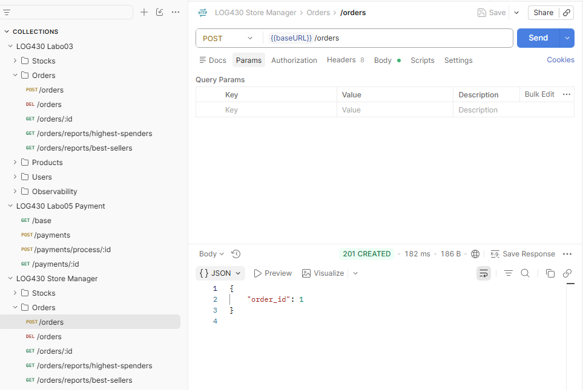

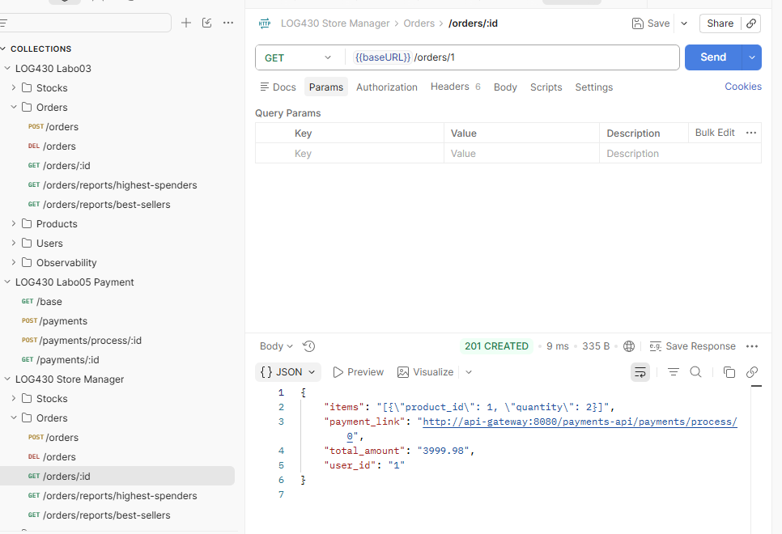

Par contre, les requêtes concernant le Payment causent problèmes : dans les deux cas, ils retournent l'erreur 404.

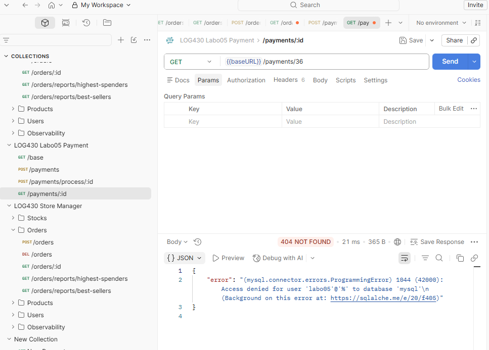
Le résultat retourne une erreur car il ne reconnait pas le endpoint.

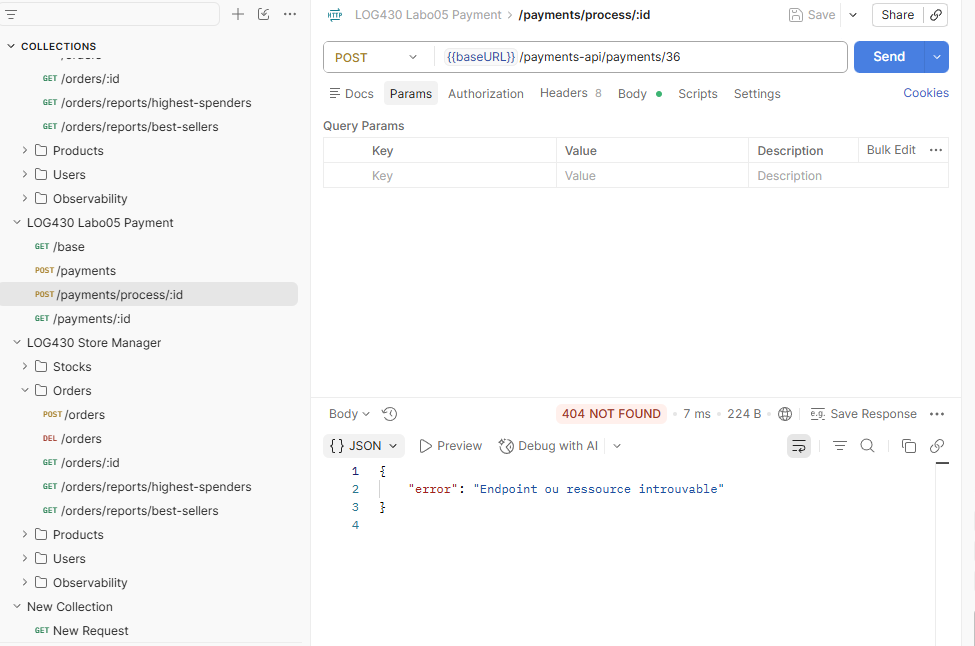
## 4.  Question 4 : Quelle méthode avez-vous dû modifier dans log430-labo05-payment et qu'avez-vous modifiée ? Justifiez avec un extrait de code.
Réponse
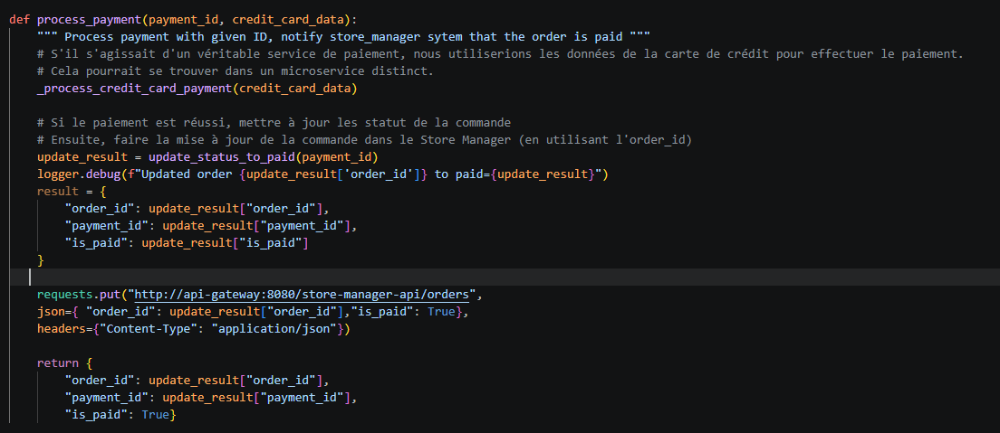
La méthode modifiée est la méthode process_payment. La valeur de retour et la requête ont été modifiés.

## 5.  Question 5 : À partir de combien de requêtes par minute observez-vous les erreurs 503 ? Justifiez avec des captures d'écran de Locust.
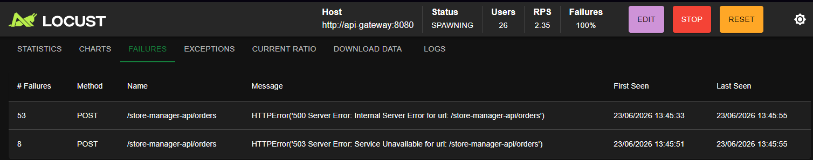

L'erreur 503 apparaît à partir de 2.35 requêtes par secondes, soit 141 requêtes par minutes.

## 6. Question 6 :  Que se passe-t-il dans le navigateur quand vous faites une requête avec un délai supérieur au timeout configuré (5 secondes) ? Quelle est l'importance du timeout dans une architecture de microservices ? Justifiez votre réponse avec des exemples pratiques.

L'API répond correctement avec une attente de 2 secondes, soit un temps d'attentes d'inférieure au timeout.
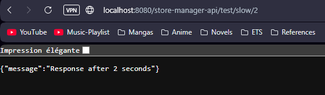

Cependant, le localhost affiche une erreur une fois que le slow atteint 10 secondes, soit au delà des 5 secondes de timeout.
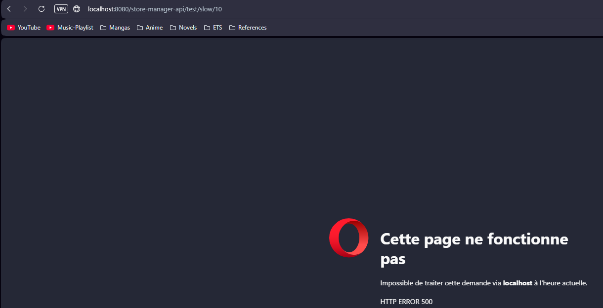

# Déploiement
(Le cas échéant, décrivez votre pipeline CI/CD et ce que vous avez appris dans ce laboratoire en ce qui concerne le déploiement. Il est obligatoire d'ajouter du code, des captures d'écran ou des sorties de terminal pour illustrer votre réponse.)

Ce laboratoire a permis d'utiliser un API Gateway. Dans ce cas-ci, l'API utilisé était KrakenD et à établir une communication inter-services de type Nord-Sud, soit la communication entre le Store-manager et payment (voir)
Ce lab nous a aussi permis de valider l'utilité des timeouts (voir Question #6) 